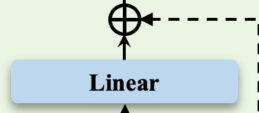

# 普通架构版

# 框架图


# ROPE

## 数学原理

在自注意力机制中，查询 $\mathbf{q}$ 和键 $\mathbf{k}$ 都来自输入序列中的向量。为了引入**位置信息**，传统Transformer使用**加法位置编码（Additive Positional Embedding）** 。RoPE提供一种更精妙的方式：

> **通过复数空间中的旋转，将不同位置的信息注入向量的相位中。**

---

d是每个token表示的向量维度

假设我们有一个向量 $\mathbf{x} \in \mathbb{R}^{d}$，我们把它的最后一维拆分为一对一对：

$$
\mathbf{x} = [x_0, x_1, x_2, x_3, ..., x_{d-2}, x_{d-1}]
\Rightarrow \mathbf{z} = [z_0, z_1, ..., z_{d/2-1}]
$$

每个复数分量：

$$
z_k = x_{2k} + i \cdot x_{2k+1}
$$

这样，我们就把实数向量转化为了复数向量 $\mathbf{z} \in \mathbb{C}^{d/2}$

---

每个位置 $p$ 有对应的旋转角度（频率受控于超参数 $\theta$）：

$$
\theta_k = \frac{1}{\theta^{2k/d}} \quad \text{for } k=0,1,...,d/2-1
$$

$$
\text{角度：} \phi_{p,k} = p \cdot \theta_k
$$

转换为复数旋转因子：

$$
\text{旋转因子：} r_{p,k} = \cos(\phi_{p,k}) + i \cdot \sin(\phi_{p,k}) = e^{i \phi_{p,k}}
$$

---

对每个复数向量分量执行旋转操作：

$$
z'_k = z_k \cdot r_{p,k}
$$

这就像是把一个二维向量（实部+虚部）旋转一个角度 $\phi_{p,k}$。

---

将旋转后的复数向量 $\mathbf{z'} \in \mathbb{C}^{d/2}$ 再转换回实数空间：

$$
z'_k = a_k + i \cdot b_k \Rightarrow [a_k, b_k]
$$

拼接起来得到新的嵌入向量：

$$
\mathbf{x}' = [\text{Re}(z'_0), \text{Im}(z'_0), \text{Re}(z'_1), \text{Im}(z'_1), ...]
$$

## 代码:预计算 RoPE 所需的旋转位置编码复数矩阵

预计算一个复数矩阵：

$$
\text{pos\_cis} \in \mathbb{C}^{\text{end} \times \frac{\text{dim}}{2}}
$$

其中：

* 每行对应一个**位置** **$p \in [0, \text{end})$**
* 每列对应一个**频率通道** **$k \in [0, \frac{d}{2})$**

最终的矩阵元素：

$$
[\text{pos\_cis}]_{p,k} = e^{i \cdot \phi_{p,k}} = \cos(\phi_{p,k}) + i\sin(\phi_{p,k})
$$

---

设：

* $d = \text{dim}$
* $p \in [0, \text{end})$ 为位置索引
* $k \in [0, d/2)$ 为频率索引
* $\theta \in \mathbb{R}^+$ 为频率缩放因子（默认 $1e6$）

---

### 第一步：计算每个频率的衰减项（频率系数）

$$
\omega_k = \frac{1}{\theta^{\frac{2k}{d}}} \quad \text{for } k = 0, 1, ..., \frac{d}{2}-1
$$

> 对应代码：

```python
freqs = 1.0 / (theta ** (torch.arange(0, dim, 2)[: (dim // 2)].float() / dim))
```

---

### 第二步：计算所有 $\phi_{p,k}$ —— 相位角矩阵

向量外积高效计算矩阵

$$
\phi_{p,k} = p \cdot \omega_k \quad \text{即外积：} \Phi = \mathbf{t} \otimes \boldsymbol{\omega}
$$

> 对应代码：

```python
t = torch.arange(end)#位置索引
freqs = torch.outer(t, freqs)
```

---

### 第三步：利用欧拉公式生成复数旋转矩阵

生成旋转编码矩阵，每个元素的值为：

$$
\text{pos\_cis}_{p,k} = \text{polar}(1, \phi_{p,k}) = e^{i \phi_{p,k}}
$$

> 对应代码：  
> ​`polar`​创建复数张量；`torch.ones_like(freqs)`​生成了一个和`freqs`​形状相同且元素全为 1 的张量，这个张量作为复数的模；`freqs`​则作为复数的角度

```python
pos_cis = torch.polar(torch.ones_like(freqs), freqs)
```

---

### 最终结果

定义：

$$
\text{pos\_cis} \in \mathbb{C}^{\text{end} \times d/2}, \quad \text{with entries } \text{pos\_cis}_{p,k} = e^{i \cdot \frac{p}{\theta^{2k/d}}}
$$

这个矩阵就是用来给查询 $\mathbf{q}$ 和键 $\mathbf{k}$ 做“旋转”的“频率相位模板”。

```python
def precompute_pos_cis(dim: int, end: int = int(32 * 1024), theta: float = 1e6):
    """
    预计算旋转位置编码（Rotary Position Embeddings, RoPE）所需的复数值

    参数:
        dim: 隐藏维度大小
        end: 最大序列长度，默认为32K
        theta: RoPE中的缩放因子，影响位置编码的频率

    返回:
        pos_cis: 预计算好的复数形式的位置编码，形状为[end, dim//2]
    """
    # 计算不同频率的逆频率项
    freqs = 1.0 / (theta ** (torch.arange(0, dim, 2)[: (dim // 2)].float() / dim))
    # 生成位置索引
    t = torch.arange(end, device=freqs.device)  # type: ignore
    # 计算外积得到每个位置对应的每个频率
    freqs = torch.outer(t, freqs).float()  # type: ignore
    # 使用欧拉公式 e^(i*θ) = cos(θ) + i*sin(θ) 生成复数
    # 幅值为1，相位为freqs的复数值
    pos_cis = torch.polar(torch.ones_like(freqs), freqs)  # complex64
    return pos_cis
```

## 代码：应用旋转位置编码

### 输入定义（张量结构）

假设：

* 查询Query张量 $\mathbf{x}_q \in \mathbb{R}^{B \times L \times H \times D}$
* 键Key张量 $\mathbf{x}_k \in \mathbb{R}^{B \times L \times H' \times D}$

其中：

* $B$：batch size（批大小）
* $L$：序列长度（token 数）
* $H$：注意力头数量（query 的）
* $H'$：KV头数量
* $D$：每个注意力头的维度（**head_dim**，必须是**偶数**）

---

### 第一步：转换为复数向量

我们将最后一维 $D$ 拆成 $D/2$ 个复数：

$$
z_{q}[b, l, h, d'] = x_{q}[b, l, h, 2d'] + i \cdot x_{q}[b, l, h, 2d'+1] \quad \text{for } d'=0,\dots,D/2-1
$$

记作：

$$
\mathbf{z}_q = \text{view\_as\_complex}(x_q)
\quad,\quad
\mathbf{z}_k = \text{view\_as\_complex}(x_k)
$$

---

### 第二步：位置编码复数旋转器 $r_{l,d'}$

​`pos_cis`​ 是形如 $\text{pos\_cis}[l, d'] = e^{i \cdot \phi_{l,d'}}$，其中：

$$
\phi_{l,d'} = l \cdot \omega_{d'}
$$

我们希望广播它到张量形状匹配 $\mathbf{z}_q$ / $\mathbf{z}_k$，于是 reshape 成：

$$
\text{shape: } [1, L, 1, D/2]
$$

这样可以按位置 $l$ 和维度 $d'$ 进行广播。

---

### 第三步：复数乘法实现旋转

复数乘法对应二维向量的旋转：

$$
z' = z \cdot e^{i \phi} = R(\phi) \cdot z
$$

也就是：

$$
\begin{bmatrix}
\text{Re}(z') \\
\text{Im}(z')
\end{bmatrix}
=
\begin{bmatrix}
\cos(\phi) & -\sin(\phi) \\
\sin(\phi) & \cos(\phi)
\end{bmatrix}
\cdot
\begin{bmatrix}
\text{Re}(z) \\
\text{Im}(z)
\end{bmatrix}
$$

这一步在代码中：

```python
xq_ * pos_cis
```

实现了所有位置的“向量旋转”。

---

### 第四步：复数还原回实数对

复数变回实数张量（实部+虚部）：

$$
\text{view\_as\_real}(z') \Rightarrow \text{shape: } [..., D/2, 2] \Rightarrow \text{flatten} \Rightarrow [..., D]
$$

得到最终旋转后的 $xq_{\text{rot}}$, $xk_{\text{rot}}$

---

### 总结：完整数学公式表示

给定：

* 实数向量 $\mathbf{x}_{q}, \mathbf{x}_{k} \in \mathbb{R}^{D}$
* 构造复数向量 $\mathbf{z} \in \mathbb{C}^{D/2}$
* 每个位置 $p$ 与维度 $k$ 的旋转角度 $\phi_{p,k} = p \cdot \omega_k$

最终应用：

$$
z_{p,k}' = z_{p,k} \cdot e^{i \cdot \phi_{p,k}} \quad \forall p, k
$$

还原成实数张量即可完成 RoPE 的嵌入。

```python
def apply_rotary_emb(xq, xk, pos_cis):
    """
    将旋转位置编码应用到查询(Q)和键(K)张量上

    参数:
        xq: 查询张量, 形状为[batch_size, seq_len, n_heads, head_dim]
        xk: 键张量, 形状为[batch_size, seq_len, n_kv_heads, head_dim]
        pos_cis: 预计算的位置编码复数

    返回:
        应用位置编码后的查询和键张量
    """
    def unite_shape(pos_cis, x):
        """
        调整pos_cis的形状使其与输入张量x兼容，便于广播计算
        """
        ndim = x.ndim
        assert 0 <= 1 < ndim
        assert pos_cis.shape == (x.shape[1], x.shape[-1])
        # 创建一个新形状，只保留序列长度和特征维度，其余维度设为1
        shape = [d if i == 1 or i == ndim - 1 else 1 for i, d in enumerate(x.shape)]
        return pos_cis.view(*shape)

    # 将Q和K重塑并转换为复数形式
    # 将最后一个维度每两个相邻元素视为一个复数的实部和虚部
    xq_ = torch.view_as_complex(xq.float().reshape(*xq.shape[:-1], -1, 2))
    xk_ = torch.view_as_complex(xk.float().reshape(*xk.shape[:-1], -1, 2))

    # 调整pos_cis的形状以便与输入张量兼容
    pos_cis = unite_shape(pos_cis, xq_)

    # 应用旋转操作：在复数域中，乘以pos_cis等同于旋转
    xq_out = torch.view_as_real(xq_ * pos_cis).flatten(3)
    xk_out = torch.view_as_real(xk_ * pos_cis).flatten(3)

    # 转换回输入张量的原始数据类型
    return xq_out.type_as(xq), xk_out.type_as(xk)
```

‍

# RMSNorm

RMSNorm 通过对输入数据归一化，使各层输入数据的分布更稳定，具体是对输入数据均方根归一化，让后续神经元更易学习数据特征。

```python
class RMSNorm(torch.nn.Module):
    """
    均方根层归一化（Root Mean Square Layer Normalization）
    相比传统的 LayerNorm，RMSNorm 计算更简单，不需要减去均值，
    只需要对均方根进行归一化，计算效率更高
    """
    def __init__(self, dim: int, eps: float = 1e-6):
        """
        初始化 RMSNorm 层

        参数:
            dim: 需要归一化的特征维度
            eps: 添加到分母中的小常数，防止除零错误
        """
        super().__init__()
        self.eps = eps
        # 可学习的缩放参数
        self.weight = nn.Parameter(torch.ones(dim))
```

‍

公式为$x / \sqrt{\text{mean}(x^2) + \text{eps}}$ ，其中$x$是输入数据，$\text{eps}$是防止除零的小常数 。

 `mean(x^2)`​ 计算的是张量 `x`​ 元素平方后的**均值**，假设张量 `x`​ 形状为 `[N, D]`​ （`N`​ 为样本数量，`D`​ 为特征维度 ） ，其数学公式为：

$$
\text{mean}(x^2)=\frac{1}{N\times D}\sum_{i = 1}^{N}\sum_{j = 1}^{D}x_{ij}^2
$$

其中 $x_{ij}$ 表示张量 `x`​ 中第 $i$ 个样本的第 $j$ 个特征值 。通过对所有元素平方求和，再除以元素总数，得到元素平方的均值。若张量 `x`​ 是更高维，原理类似，都是对所有元素平方求和后除以总元素个数。

```python
def _norm(self, x):
    """
    执行 RMS 归一化计算
    计算公式: x / sqrt(mean(x^2) + eps)
    """
    return x * torch.rsqrt(x.pow(2).mean(-1, keepdim=True) + self.eps)
```

weight为参数张量

```python
  def forward(self, x):
    """
    前向传播函数
    先将输入转为 float 类型进行归一化计算，然后再转回原始数据类型
    最后乘以可学习的权重参数
    """
    return self.weight * self._norm(x.float()).type_as(x)
```

‍

# FFN（Feed Forward Network，前馈网络）

$\text{SiLU}(x) = x \cdot \sigma(x) = x \cdot \frac{1}{1 + e^{-x}}$

```python
    def __init__(self, config: LMConfig):
        """
        初始化前馈网络层

        参数:
            config: 模型配置参数
        """
        super().__init__()
        # 如果未指定隐藏层维度，则根据模型维度计算
        if config.hidden_dim is None:
            # 首先设置为模型维度的4倍
            hidden_dim = 4 * config.dim
            # 然后取2/3，这是SwiGLU变体的常用设置
            hidden_dim = int(2 * hidden_dim / 3)
            # 将隐藏维度调整为multiple_of的倍数，有助于硬件加速
            config.hidden_dim = config.multiple_of * ((hidden_dim + config.multiple_of - 1) // config.multiple_of)

        # 第一个投影层：将输入从模型维度映射到隐藏维度
        self.w1 = nn.Linear(config.dim, config.hidden_dim, bias=False)
        # 第二个投影层：将激活后的结果映射回模型维度
        self.w2 = nn.Linear(config.hidden_dim, config.dim, bias=False)
        # 第三个投影层：用于门控机制，与w1共同作用
        self.w3 = nn.Linear(config.dim, config.hidden_dim, bias=False)
        # dropout层，用于正则化
        self.dropout = nn.Dropout(config.dropout)
```

图片的虚线残差在`MiniMindBlock`​实现

```python
    def forward(self, x):
        """
        前馈网络的前向传播

        实现公式: FFN(x) = dropout(W₂·(SiLU(W₁·x) * W₃·x))

        参数:
            x: 输入张量，形状为 [batch_size, seq_len, hidden_dim]

        返回:
            经过前馈网络处理后的张量，形状与输入相同
        """
        # SwiGLU激活函数变体：
        # 1. 计算W₁·x并应用SiLU激活函数
        # 2. 计算W₃·x作为门控信号
        # 3. 将两者相乘
        # 4. 通过W₂投影回原始维度
        # 5. 应用dropout
        return self.dropout(self.w2(F.silu(self.w1(x)) * self.w3(x)))
```

# GQA（Grouped - Query Attention）

## 代码：初始化函数

```python
def __init__(self, args: LMConfig):
    super().__init__()
    
    # 设置KV头数量（如果没指定，则等于Q头数量）
    self.n_kv_heads = args.n_heads if args.n_kv_heads is None else args.n_kv_heads
    assert args.n_heads % self.n_kv_heads == 0  # Q头数必须是KV头数的整数倍

    # 设置本地Q/KV头数量
    self.n_local_heads = args.n_heads
    self.n_local_kv_heads = self.n_kv_heads
    self.n_rep = self.n_local_heads // self.n_local_kv_heads  # 每个KV头需要复制多少次

    # 每个注意力头的维度（例如dim=4096, n_heads=32, 则head_dim=128）
    self.head_dim = args.dim // args.n_heads

    # 定义 Q、K、V 的线性映射层
    self.wq = nn.Linear(args.dim, args.n_heads * self.head_dim, bias=False)
    self.wk = nn.Linear(args.dim, self.n_kv_heads * self.head_dim, bias=False)
    self.wv = nn.Linear(args.dim, self.n_kv_heads * self.head_dim, bias=False)

    # 输出映射层：将多头拼接结果映射回模型维度
    self.wo = nn.Linear(args.n_heads * self.head_dim, args.dim, bias=False)

    # 注意力权重和残差连接的Dropout
    self.attn_dropout = nn.Dropout(args.dropout)
    self.resid_dropout = nn.Dropout(args.dropout)
    self.dropout = args.dropout

    # 是否启用 Flash Attention（仅在 PyTorch >= 2.0 且配置开启时可用）
    self.flash = hasattr(torch.nn.functional, 'scaled_dot_product_attention') and args.flash_attn

    # 构造因果掩码（mask）：确保只能看到当前及之前的位置
    mask = torch.full((1, 1, args.max_seq_len, args.max_seq_len), float("-inf"))
    mask = torch.triu(mask, diagonal=1)  # 上三角为 -inf，其余为0
    self.register_buffer("mask", mask, persistent=False)
```

## 代码：前向传播配合框架图理解

传入的x在`MiniMindBlock`​ 调用了`attention_norm`​的RMSNOrm

Step 1: Q/K/V 映射对应线性层，把x和kqv矩阵相乘


Step 3: 应用旋转位置编码 RoPE

xq, xk = apply_rotary_emb(xq, xk, pos_cis)

QK进行ROPE

​

Step 5: 重排维度 + KV复制（如果KV头较少）

GQA 的核心思想是：

> 多个 Q 头共享同一组 K/V

```python
xk = repeat_kv(xk, self.n_rep)
xv = repeat_kv(xv, self.n_rep)
```


Step 6:手动计算注意力

Q × K\^T 点积 → 注意力分数

```python
scores = (xq @ xk.transpose(-2, -1)) / math.sqrt(self.head_dim)
scores += self.mask[:, :, :seq_len, :seq_len]
```


Softmax + Dropout → 权重加权 V

```python
scores = F.softmax(scores.float(), dim=-1).type_as(xq)
scores = self.attn_dropout(scores)
output = scores @ xv
```


Step 7: 恢复原维度并输出

```python
output = output.transpose(1, 2).reshape(bsz, seq_len, -1)
output = self.resid_dropout(self.wo(output))
```



```python
def forward(self, x, pos_cis, past_key_value=None, use_cache=False):
    # 获取 batch 和序列长度
    bsz, seq_len, _ = x.shape

    # Step 1: Q/K/V 映射
    xq, xk, xv = self.wq(x), self.wk(x), self.wv(x)

    # Step 2: 重塑为多头形状
    xq = xq.view(bsz, seq_len, self.n_local_heads, self.head_dim)
    xk = xk.view(bsz, seq_len, self.n_local_kv_heads, self.head_dim)
    xv = xv.view(bsz, seq_len, self.n_local_kv_heads, self.head_dim)

    # Step 3: 应用旋转位置编码 RoPE
    xq, xk = apply_rotary_emb(xq, xk, pos_cis)

    # Step 4: 如果存在KV缓存（用于推理加速），则将旧KV与当前拼接
    if past_key_value is not None:
        xk = torch.cat([past_key_value[0], xk], dim=1)
        xv = torch.cat([past_key_value[1], xv], dim=1)
    past_kv = (xk, xv) if use_cache else None

    # Step 5: 重排维度 + KV复制（如果KV头较少）
    xq = xq.transpose(1, 2)  # [B, H, T, D]
    xk = repeat_kv(xk, self.n_rep).transpose(1, 2)  # KV扩展
    xv = repeat_kv(xv, self.n_rep).transpose(1, 2)

    # Step 6: Flash Attention（如果支持）或手动计算注意力
    if self.flash and seq_len != 1:
        output = F.scaled_dot_product_attention(
            xq, xk, xv, attn_mask=None, dropout_p=self.dropout if self.training else 0.0, is_causal=True
        )
    else:
        # 普通注意力计算：Q·K^T / sqrt(d)
        scores = (xq @ xk.transpose(-2, -1)) / math.sqrt(self.head_dim)
        scores += self.mask[:, :, :seq_len, :seq_len]  # 加上因果掩码
        scores = F.softmax(scores.float(), dim=-1).type_as(xq)  # softmax归一化
        scores = self.attn_dropout(scores)  # dropout
        output = scores @ xv  # 加权和

    # Step 7: 恢复原维度并输出
    output = output.transpose(1, 2).reshape(bsz, seq_len, -1)  # 合并所有头
    output = self.resid_dropout(self.wo(output))  # 映射回模型维度
    return output, past_kv
```

‍

‍

# TransformerLayer `MiniMindBlock`​


```python
    def forward(self, x, pos_cis, past_key_value=None, use_cache=False):
        """
        前向传播函数

        参数:
            x: 输入张量，形状为 [batch_size, seq_len, hidden_dim]
            pos_cis: 旋转位置编码
            past_key_value: 可选的KV缓存，用于加速自回归生成
            use_cache: 是否使用并返回KV缓存

        返回:
            out: 经过处理后的输出张量
            past_kv: 更新后的KV缓存（如果use_cache=True）
        """
        # 1. 注意力子层：先归一化，再计算注意力，最后应用残差连接
        # 先对输入进行层归一化
        h_attn, past_kv = self.attention(
            self.attention_norm(x),
            pos_cis,
            past_key_value=past_key_value,
            use_cache=use_cache
        )
        # 应用第一个残差连接: x + Attention(LayerNorm(x))
        h = x + h_attn

        # 2. 前馈网络子层：先归一化，再通过前馈网络，最后应用残差连接
        # 应用第二个残差连接: h + FFN(LayerNorm(h))
        out = h + self.feed_forward(self.ffn_norm(h))
        return out, past_kv
```

# 主体框架(MiniMindLM)


‍

tokenizer encode后传入input_ids

输入embedding

```python
h = self.dropout(self.tok_embeddings(input_ids))
```


调用堆叠的transformer

‍

```python
for l, layer in enumerate(self.layers):
    h, past_kv = layer(h, pos_cis, ...)
    past_kvs.append(past_kv)
```


最终归一化（RMSNorm）

```python
logits = self.output(self.norm(h)[:, slice_indices, :])
```


‍

```python
    def forward(self,
                input_ids: Optional[torch.Tensor] = None,
                past_key_values: Optional[List[Tuple[torch.Tensor, torch.Tensor]]] = None,
                use_cache: bool = False,
                logits_to_keep: Union[int, torch.Tensor] = 0,
                **args):
        """
        模型前向传播函数

        参数:
            input_ids: 输入的token ID，形状为[batch_size, seq_len]
            past_key_values: 可选的KV缓存，用于加速自回归生成
            use_cache: 是否使用并返回KV缓存
            logits_to_keep: 控制只计算部分位置的logits，可以是整数或张量
            **args: 其他参数，如start_pos（用于RoPE计算的起始位置）

        返回:
            CausalLMOutputWithPast对象，包含:
            - logits: 预测的下一个token概率分布
            - past_key_values: 更新后的KV缓存
            - last_hidden_state: 最后一层的隐藏状态
            - aux_loss: MoE模型的辅助损失（如果使用）
        """
        # 初始化KV缓存，如果未提供则为每层创建None
        past_key_values = past_key_values or [None] * len(self.layers)

        # 获取起始位置，用于RoPE计算，默认为0
        start_pos = args.get('start_pos', 0)

        # 1. 词元嵌入：将输入token ID转换为向量表示并应用dropout
        h = self.dropout(self.tok_embeddings(input_ids))

        # 2. 获取当前序列对应的位置编码
        pos_cis = self.pos_cis[start_pos:start_pos + input_ids.size(1)]

        # 3. 依次通过每个Transformer层
        past_kvs = []
        for l, layer in enumerate(self.layers):
            h, past_kv = layer(
                h, pos_cis,
                past_key_value=past_key_values[l],
                use_cache=use_cache
            )
            past_kvs.append(past_kv)

        # 4. 确定需要计算logits的位置索引
        # 如果logits_to_keep是整数，则只保留最后logits_to_keep个位置
        # 否则使用提供的张量作为索引
        slice_indices = slice(-logits_to_keep, None) if isinstance(logits_to_keep, int) else logits_to_keep

        # 5. 计算输出logits：先归一化，然后通过输出层
        logits = self.output(self.norm(h)[:, slice_indices, :])

        # 6. 计算MoE辅助损失（如果使用MoE）
        aux_loss = sum(l.feed_forward.aux_loss for l in self.layers if isinstance(l.feed_forward, MOEFeedForward))

        # 7. 设置输出对象的各个字段
        self.OUT.__setitem__('last_hidden_state', h)  # 最后的隐藏状态
        self.OUT.__setitem__('logits', logits)  # 预测的logits
        self.OUT.__setitem__('aux_loss', aux_loss)  # MoE辅助损失
        self.OUT.__setitem__('past_key_values', past_kvs)  # KV缓存

        return self.OUT
```

‍

softmax和tokenizer decoder在另一个函数`_stream`​体现


SoftMax（概率化）

```python
logits /= (temperature + 1e-9)  # 温度调节
logits = F.softmax(logits, dim=-1)
```

Decoder：采样生成下一个 token

> pytorch知识
>
> torch.multinomial(input, num_samples, replacement=False)
>
> * ​`input`​：是一个 **一维或二维的概率分布**，每个元素的值表示该类别被选中的“权重”。
> * ​`num_samples`​：你想从中采样多少个元素（通常是1个）。
> * ​`replacement`​：是否允许重复采样（默认为False，但语言模型中我们一般只取1个，不重复）。

```python
input_ids_next = torch.multinomial(F.softmax(logits, dim=-1), num_samples=1)
```
