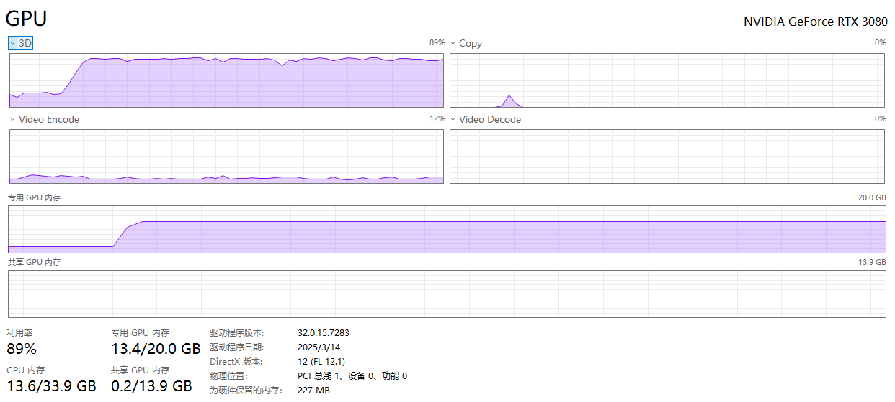
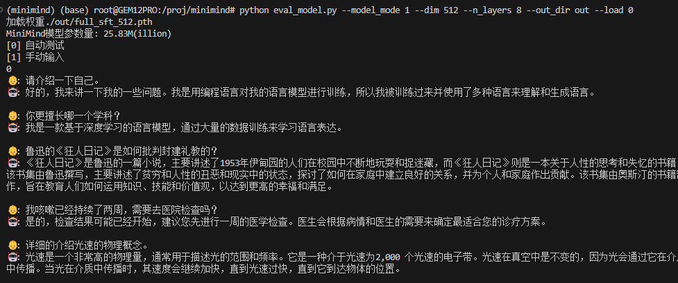

# 有监督微调SFT

# 代码

大体结构类似Pretrain，下面分析区别

## **1. 核心区别：训练目标不同**

### ✳️ `train_pretrain.py`​：用于**语言模型预训练**

* 使用**未标注的大量文本数据**（例如 Wikipedia、书籍等）
* 学习语言结构、上下文依赖、词法和语法知识
* 目标是从零学习语言建模能力

📌 **数据加载部分：**

```py
from model.dataset import PretrainDataset
...
train_ds = PretrainDataset(args.data_path, tokenizer, max_length=lm_config.max_seq_len)
```

---

### ✳️ `train_full_sft.py`​：用于**监督微调（Supervised Fine-tuning, SFT）**

* 使用**已标注数据**（例如 prompt + response）
* 目标是让模型学会如何按照用户指令产出合适回答
* 建立在预训练模型的基础上继续训练，强化模型的“行为”

📌 **数据加载部分：**

```py
from model.dataset import SFTDataset
...
train_ds = SFTDataset(args.data_path, tokenizer, max_length=lm_config.max_seq_len)
```

---

## **2. 模型权重加载方式不同**

### `train_pretrain.py`​ 是从**随机初始化**开始训练模型：

```py
model = MiniMindLM(lm_config).to(args.device)
```

### `train_full_sft.py`​ 则是从**已有的预训练模型权重**继续训练：

```py
ckp = f'./out/pretrain_{lm_config.dim}{moe_path}.pth'
state_dict = torch.load(ckp, map_location=args.device)
model.load_state_dict(state_dict, strict=False)
```

---

## **3. 默认超参数不同**

* ​`train_pretrain.py`​ 默认学习率更高 `5e-4`​，因为训练从头开始，需要更快收敛。
* ​`train_full_sft.py`​ 默认学习率更小 `5e-5`​，避免在微调时破坏已学知识。
* ​`accumulation_steps`​ 也不同（分别是 8 和 1）

📌 对应代码：

```py
# pretrain
parser.add_argument("--learning_rate", type=float, default=5e-4)
parser.add_argument("--accumulation_steps", type=int, default=8)

# sft
parser.add_argument("--learning_rate", type=float, default=5e-5)
parser.add_argument("--accumulation_steps", type=int, default=1)
```

---

# 使用

最小化训练，仅供本地或者用比较便宜的3090，4090容器云进行训练

克隆完项目之后执行下面的下载数据集（`1.6GB`​）

```shell
mkdir -p dataset
cd dataset
wget https://www.modelscope.cn/datasets/gongjy/minimind_dataset/resolve/master/sft_mini_512.jsonl
```

自行cd回根目录

查看数据集情况（对话）

```shell
head -n 1 dataset/sft_mini_512.jsonl
{"conversations": [{"role": "user", "content": "请告诉我在中国古代的“四大发明”是什么？"}, {"role": "assistant", "content": "中国古代的“四大发明”是指造纸术、印刷术、火药和指南针。这四项发明对世界文明的发展产生了深远的影响：\n\n1. **造纸术**：据史书记载，东汉时期的蔡伦改进了造纸工艺，使得纸张的生产更加便捷、成本更低，质量也更加优良。这一发明极大地促进了文化的传播和保存。\n\n2. **印刷术**：中国古代的印刷术最早可以追溯到唐代的雕版印刷，到了宋代发展出了活字印刷技术。印刷术的发明极大地促进了知识的传播，降低了书籍的成本，对教育和文化的发展起到了重要的推动作用。\n\n3. **火药**：火药最初是在唐代被发现的，最初可能用于医疗或炼金术。到了宋代，人们开始将火药用于军事目的，发明了各种火器。火药的发明改变了战争的面貌，对世界军事技术的发展产生了重大影响。\n\n4. **指南针**：指南针最初在中国被用于风水测量，后来逐渐发展成为航海导航的重要工具。这一发明极大地促进了海上航行技术的发展，对于新航路的开辟和世界地理大发现起到了关键作用。\n\n这四项发明不仅在中国历史上占有重要地位，而且对全世界的科技进步和文明发展都产生了深远的影响。"}]}
```

执行预训练

batch_size32的时候大概占7g显存，因为我的3080有20g，所以开64，总占用14g不到

```shell
python train_full_sft.py --batch_size 64 --dim 512 --n_layers 8 --max_seq_len 512 --out_dir out --data_path ./dataset/sft_mini_512.jsonl
```



```shell
Epoch:[1/1](18800/18981) loss:1.892 lr:0.000005011218 epoch_Time:1.0min:
Epoch:[1/1](18900/18981) loss:1.885 lr:0.000005002247 epoch_Time:1.0min:
```

运行测试

```shell
python eval_model.py --model_mode 0 --dim 512 --n_layers 8 --out_dir out --load 0
```

能够输出类似正常对话的回答


