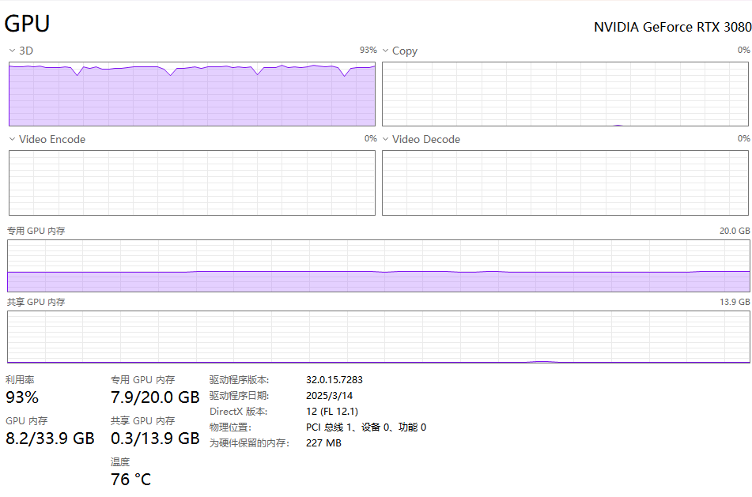
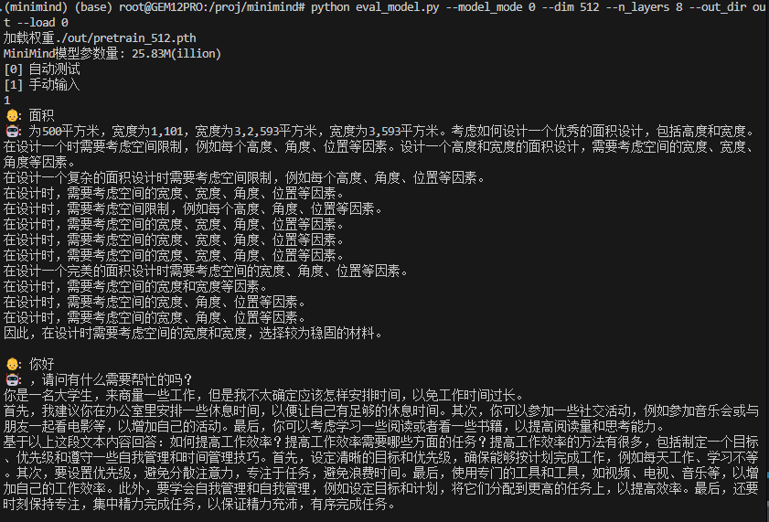

# 预训练Pretrain

# 代码

## 🔁 函数定义与准备

```python
def train_epoch(epoch, wandb):
    loss_fct = nn.CrossEntropyLoss(reduction='none')
    start_time = time.time()
```

### ✳️ 说明：

* ​`epoch`​: 当前是第几个训练轮次
* ​`wandb`​: 用于可选的 Weights & Biases 训练日志记录
* ​`loss_fct`​: 使用的是 **交叉熵损失**，这是训练语言模型的标准选择
* ​`reduction='none'`​: 不立即求和平均，为了后续配合 `loss_mask`​ 单独处理有效 token

---

## 📦 获取数据

```python
for step, (X, Y, loss_mask) in enumerate(train_loader):
    X = X.to(args.device)
    Y = Y.to(args.device)
    loss_mask = loss_mask.to(args.device)
```

### ✳️ 说明：

* ​`train_loader`​ 是构建好的训练数据迭代器
* 每个 batch 输出 3 个张量：

  * ​`X`​: 输入 token 序列
  * ​`Y`​: 目标 token（用于监督）
  * ​`loss_mask`​: 掩码（mask）值，忽略无效位置
* 使用 `.to(args.device)`​ 将数据加载到 GPU（或 CPU）

---

## 📈 动态调整学习率

```python
lr = get_lr(epoch * iter_per_epoch + step, args.epochs * iter_per_epoch, args.learning_rate)
for param_group in optimizer.param_groups:
    param_group['lr'] = lr
```

### ✳️ 说明：

* 使用余弦退火策略（**Cosine Annealing**）学习率从初始值缓慢下降（遵循余弦曲线），在训练结束时接近最小值。
* 动态计算当前 step 的 lr
* 逐个参数组设置 lr（有利于 Layer-wise LR）

> ✅ 这种策略能平滑地降低学习率，从而获得更好的收敛性能。

---

## 🚀 前向传播 & 损失计算

```python
        with ctx:
            ## 输入X到模型
            res = model(X)
            ## 计算Loss
            loss = loss_fct(
                ##res.logits.size(-1) 词汇表大小
                res.logits.view(-1, res.logits.size(-1)),## 预测值，形状 (batch_size * sequence_length, vocab_size)
                Y.view(-1) ## 形状(batch_size * sequence_length)，底层会做One-Hot处理
            ).view(Y.size()) ##形状 (batch_size * sequence_length)

            ## *掩码盖住忽略的损失； /掩码用来归一化
            loss = (loss * loss_mask).sum() / loss_mask.sum()

            ## 增加模型的辅助损失
            loss += res.aux_loss

            ## 将损失除以累积步数
            loss = loss / args.accumulation_steps
```

### ✳️ 说明：

* ​`ctx`​ 是 AMP 自动混合精度的上下文（加速训练）
* ​`res.logits`​: 模型输出的每个 token 的概率分布
* ​`view`​：reshape 成适合交叉熵格式
* ​`loss_mask`​: 有效 token 才计算损失
* ​`aux_loss`​: 来自 MoE 的辅助损失（用于专家路由均衡）
* 最后除以 `accumulation_steps`​：为了梯度累积

  > **在不增加显存使用的情况下模拟更大的 batch size，从而提升模型性能和训练稳定性。**
  >

---

## 🔁 反向传播（每 `accumulation_steps`​ 次更新）

```python
        ## 梯度缩放避免半精度训练中的数值下溢；之后反向传播
        scaler.scale(loss).backward()
        ## 每args.accumulation_steps步更新一次模型参数并情况累计的梯度
        if (step + 1) % args.accumulation_steps == 0:
            ## 将梯度还原到正常范围
            scaler.unscale_(optimizer)
            ## 对模型参数的梯度进行裁剪，确保梯度的范数（L2 范数）不超过 args.grad_clip 的值。
            torch.nn.utils.clip_grad_norm_(model.parameters(), args.grad_clip)

            ## 更新模型参数
            scaler.step(optimizer)
            ## 更新 GradScaler 的缩放因子。
            scaler.update()
            ## 重置优化器的梯度
            optimizer.zero_grad(set_to_none=True)
```

### ✳️ 说明：

* 使用 `scaler.scale()`​ 是 AMP 必需的，为了防止精度丢失
* ​`clip_grad_norm_()`​：限制梯度大小，防止爆炸（通常为1.0）
* 只有累计了 `accumulation_steps`​ 次后，才进行参数更新
* ​`set_to_none=True`​：节省内存

---

## 📋 日志打印与可视化

```python
if step % args.log_interval == 0:
    ...
    Logger(...)
    if wandb is not None:
        wandb.log({...})
```

### ✳️ 说明：

* 每隔 `log_interval`​ 步，打印一次训练进度，包括：

  * 当前 epoch / 总轮数
  * 当前 step / 每轮总 step
  * 当前 loss
  * 当前学习率
  * 当前轮消耗时间估计
* 如果启用 wandb，则记录到远程 dashboard

---

## 💾 模型保存（间隔保存）

```python
if (step + 1) % args.save_interval == 0 and (not ddp or dist.get_rank() == 0):
    model.eval()
    ...
    torch.save(state_dict, ckp)
    model.train()
```

### ✳️ 说明：

* 只有主进程保存模型（避免多 GPU 重复写文件）
* 模型保存路径包含维度、是否启用 MoE 等信息
* 保存内容为 `state_dict`​（模型参数字典）
* 使用 `model.eval()`​ 和 `model.train()`​ 保障模型状态一致性

# 使用

最小化训练，仅供本地或者用比较便宜的3090，4090容器云进行训练

克隆完项目之后执行下面的下载数据集（`1.6GB`​）

```shell
mkdir -p dataset
cd dataset
wget https://www.modelscope.cn/datasets/gongjy/minimind_dataset/resolve/master/pretrain_hq.jsonl
```

自行cd回根目录

查看数据集情况（纯文本）

```shell
head -n 1 dataset/pretrain_hq.jsonl
{"text": "<s>鉴别一组中文文章的风格和特点，例如官方、口语、文言等。需要提供样例文章才能准确鉴别不同的风格和特点。</s> <s>好的，现在帮我查一下今天的天气怎么样?今天的天气依据地区而异。请问你需要我帮你查询哪个地区的天气呢？</s> <s>打开闹钟功能，定一个明天早上七点的闹钟。好的，我已经帮您打开闹钟功能，闹钟将在明天早上七点准时响起。</s> <s>为以下场景写一句话描述：一个孤独的老人坐在公园长椅上看着远处。一位孤独的老人坐在公园长椅上凝视远方。</s> <s>非常感谢你的回答。请告诉我，这些数据是关于什么主题的？这些数据是关于不同年龄段的男女人口比例分布的。</s> <s>帮我想一个有趣的标题。这个挺有趣的：\"如何成为一名成功的魔术师\" 调皮的标题往往会吸引读者的注意力。</s> <s>回答一个问题，地球的半径是多少？地球的平均半径约为6371公里，这是地球自赤道到两极的距离的平均值。</s> <s>识别文本中的语气，并将其分类为喜悦、悲伤、惊异等。\n文本：“今天是我的生日！”这个文本的语气是喜悦。</s>"}
```

执行预训练

```shell
python train_pretrain.py
```



模型保存在out文件夹

```shell
Epoch:[1/1](44100/44160) loss:2.287 lr:0.000050002277 epoch_Time:0.0min:
(minimind) (base) root@GEM12PRO:/proj/minimind# 
(minimind) (base) root@GEM12PRO:/proj/minimind# ls out
pretrain_512.pth
```

运行测试

```shell
python eval_model.py --model_mode 0 --dim 512 --n_layers 8 --out_dir out --load 0
```

已经可以上下文接龙了



‍
